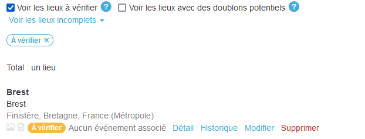
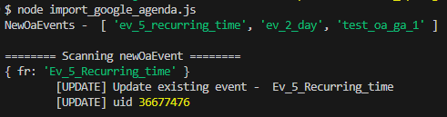
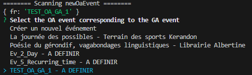
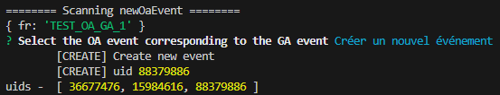
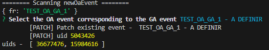

# Kerlandrier

_Le Kerlandrier est un site affiche. Il a vocation à **agréger** et **mettre à disposition** les événements sur le territoire de la CCA (et plus si affinités)._
_Ce dépôt stocke du code utile pour un administrateur du projet. Ce sont essentiellement des aides à la mise à jour du contenu du projet Kerlandrier._

* * *

Le [Kerlandrier](https://hentou.cc/tsts/convivialites/) utilise un [calendrier Openagenda](https://openagenda.com/fr/flux-cca-test) et son [api](https://developers.openagenda.com/00-structure-evenement/) pour générer son contenu à chaque ouverture de la page.


## Contexte

La **mise à disposition** des événements se veut _numérique_ et _physique_. _Numérique_ via la [page web statique du Kerlandrier](https://hentou.cc/tsts/convivialites/).
_Physique_ via un usage Web2Print qui permet d'imprimer le contenu sur un format papier (A5, A4, A4, A0 pour les plus ambitieux).

L'**agrégation** des événements est l'obstacle principal à la réussite du projet.

### Freins à l'agrégation

*   Sources d'informations multiples:
    + Affichage papier
    + Newsletter de lieux et d'associations
    + Evénements et posts Facebbok
    + Sites Web
    + Bouche à oreille/ Discussions Whatsapp
*   Blocages techniques à l'automatisation:
    + Blocage par Facebook du scrap d'infos sur son contenu
    + Incompatibilités des formats de calendrier ouverts, Google, Apple, ...
    + Pas de solution simple, open source, trouvée pour faire ce travail
*   Temps de contribution manuel
    + La flemme


## Outils du dépôt

### Import via Google Agenda

*   Importer les événements d'un Google Agenda (`.ical`) à partir de son URL > `import_google_agenda.js`
    + Si aucune complication, l'événement Openagenda est créé et une valeur `uid-externe` est mise à jour
    + Si un événement avec le même `uid-externe` est trouvé dans Openagenda, on fait une mise à jour (à débattre, on pourrait aussi ne rien faire)
    + S'il existe des événements dans la même plage de date, on interagit avec l'administrateur
        - Soit de mettre à jour un événement existant de l'Openagenda (avec l'`uid-externe`)
        - Soit de créer un nouvel événements


### Validation de Lieux

*   Valider tous les [Lieux](https://openagenda.com/flux-cca-test/admin/locations) "à valider" > `validate_locations.js`
    + Pour éviter de devoir le faire via l'UI Openagenda,
    + Ca fait professionnel.



### Import via Google doc

_[TO DO]_

### Evénements récurrents via Google Agenda

_[TO DO]_

## Installation

### Installer les librairies
```shell 
$ npm i
```
### Charger les credentials
_Demander à une bonne âme un .env_

Pour les secrets Open Agenda (API pub & secret keys):
*   Créer un compte [Open Agenda](https://openagenda.com/)
*   Récupérer votre clé publique dans les paramètres de votre compte
*   Envoyer une demande à support@openagenda.com pour demander votre clé privée (cf https://developers.openagenda.com/00-introduction/#utilisation-en-criture/)


## Utilisation

```shell
$ node import_google_agenda.js
$ node validation_locations.js
```

## `import_google_agenda.js`

### Détails sur la résolution des ambigüités

\
*Evénement trouvé en auto : Mise à jour auto*

\
*Evénement non trouvé automatiquement dans OA : On interagit avec l'administrateur.*

\
*Evénement non trouvé automatiquement dans OA & l'administrateur souhaite créer l'événement issu de GA* 

\
*Evénement non trouvé automatiquement dans OA mais l'administrateur l'a trouvé*


## Contribuer

Le projet dit oui à votre assistance si vous :

*   Êtes au courant de tous les bons plans du territoire,
*   Remplissez l'[Openagenda](https://openagenda.com/fr/flux-cca-test),
*   Partagez un Google Agenda personnel que vous remplissez consciencieusement d'événements de la CCA et que vous pouvez partager,
*   Scrappez les internets (et surtout les GAFAM) pour en extraire les substantifiques événements,
*   Faites de la spéculation sur le marché du nom de domaine pour inonder les internets de Kerlandrier,
*   Collez des affiches à vos heures perdues.

## Auteurs & remerciements

*   Convivialités Inc.
*   Le Jockey
*   Le [sdk oa](https://github.com/OpenAgenda/oa-public/tree/main/sdk-js)

### Licence

_Pas de licence_
